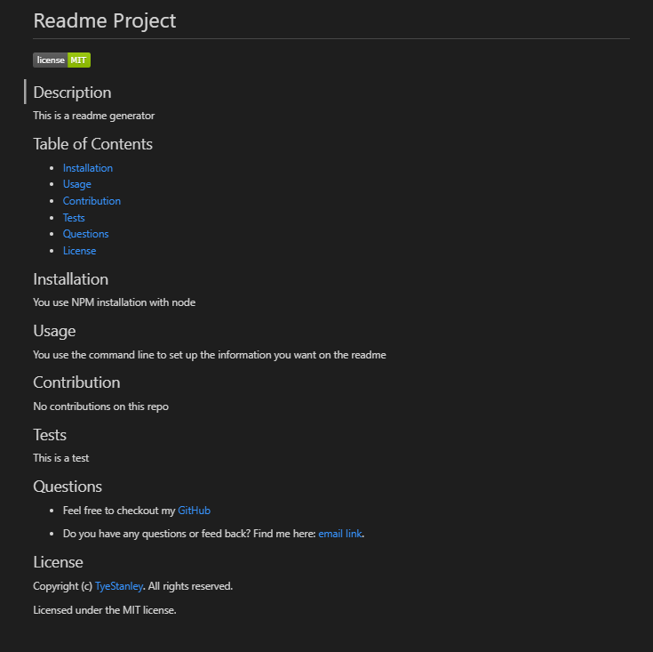

# README Generator

A command-line tool that creates a professional README.md file based on the user's input. Allowing the project's creator to focus more time on the project. Feel free to download and customize it as you need.

## Installation

1. Download/clone my repository
2. This app requires node.js to be used.
3. Do `npm install` to install the required dependencies

## Usage

* The command `node index.js` will be used to start the application.
* The user is then asked to respond to questions to generate the README file.
* After all of the questions have been answered, the project title and subsequent sections are generated:
  * Description
  * Table of Contents (there are clickable links to the relevant sections)
  * Installation
  * Usage
  * Contributing
  * Tests
  * Questions
  * License
  
* These are examples of the readme created with this application:

[Readme Sample file](./dist/README.md)

[Video Showcase](https://drive.google.com/file/d/1wlPoLdvssAxB5NaprzoXis1kngGq_QJC/view)

## Features

* JavaScript
* Node.js
* NPM

## License

  Copyright &copy; Tye Stanley. All rights reserved.
  
  Licensed under the [MIT](LICENSE) license.